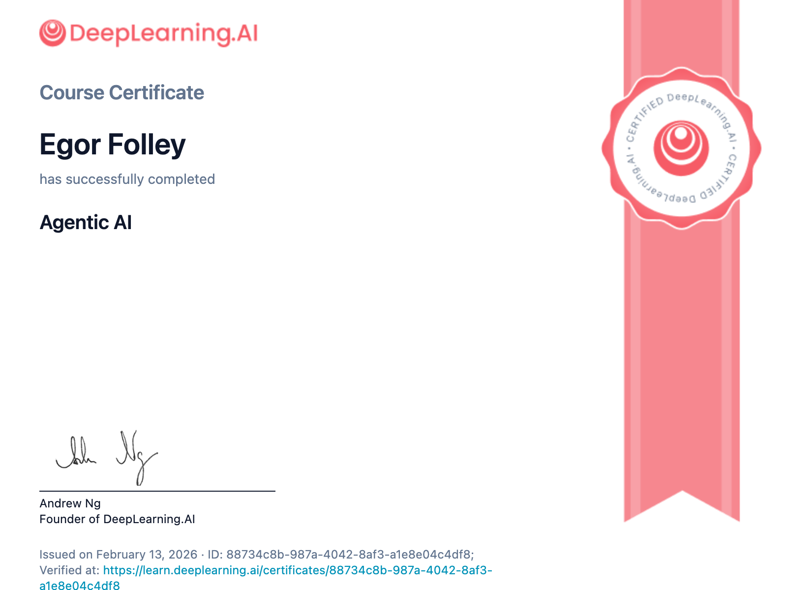

# Agentic AI Deep Learning Course

A short course project with 5 modules and supporting notebooks for code, assignments, and experiments.



## Contents

- module_1.ipynb to module_5.ipynb: Core lecture notebooks.
- codes_and_assignments/: Supplementary code and assignment notebooks.
- requirements.txt: Python dependencies for the notebooks.

## Getting Started

1. Create a virtual environment and install dependencies:

   ```bash
   python -m venv .venv
   source .venv/bin/activate
   pip install -r requirements.txt
   ```
2. Launch Jupyter and open the module notebooks:

   ```bash
   jupyter lab
   ```

## Notes

- Some notebooks may depend on environment variables defined in .env.
- Run the modules in order if you are following the course sequence.
